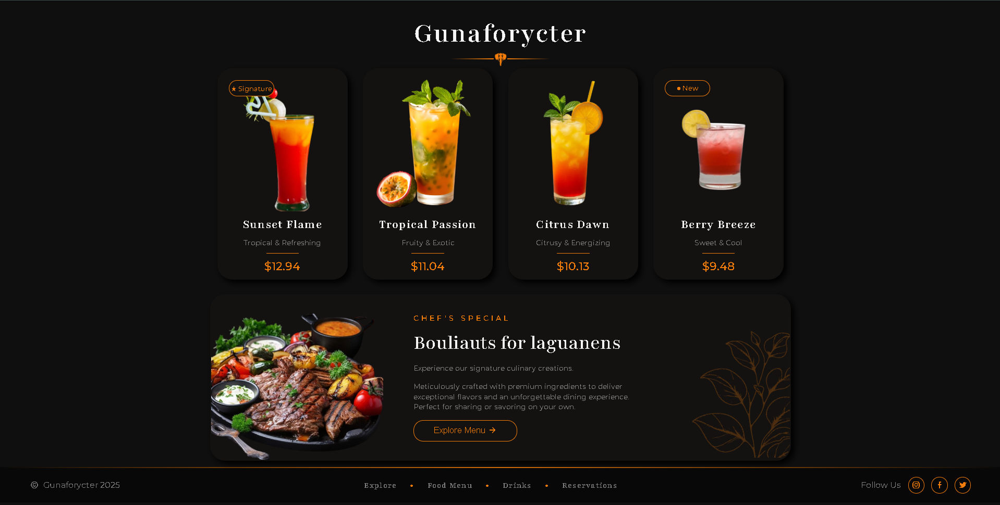

# Gunaforycter - Premium Restaurant UI 🍽️🍹

A sleek, dark-themed front-end web interface for a luxury restaurant and bar. This project focuses on translating a high-fidelity static design into a fully functional, pixel-perfect HTML/CSS layout.

## 🚀 Overview

This project was built to practice and showcase modern CSS layout techniques, specifically focusing on complex Flexbox structures, custom hover states, and visually engaging gradients and shadows.

## ✨ Features

* **Modern Dark Theme:** Utilizes a custom `#0f0f0f` and `#141211` color palette with vibrant `#f47d09` orange accents.
* **Dynamic Hover States:** Interactive UI cards with smooth transitions, linear gradients, and glowing box shadows.
* **CSS Flexbox Architecture:** Clean and organized layout alignment without relying on heavy frameworks.
* **Custom Typography:** Integrated Google Fonts (*Playfair* and *Montserrat*) to elevate the luxury aesthetic.
* **Semantic HTML:** Clean, readable, and well-structured markup.

## 🛠️ Technologies Used

* **HTML5**
* **CSS3** (Flexbox, Pseudo-elements, Custom Properties)
* **Icons:** RemixIcon

## 💡 Key Learnings

During this build, I strengthened my understanding of:
* Using `::before` and `::after` pseudo-elements for clean UI details (like navigation bullets and title dividers).
* Managing overlapping elements and absolute positioning within hidden overflows.
* Creating cohesive, glowing hover states using `box-shadow` and `linear-gradient`.

## 📸 Preview

**🟢 Live Demo:** [View the UI Card Here](https://gunaforycter-restaurant-ui.vercel.app/)

A highly visual UI card showcasing a premium bistro's UI
